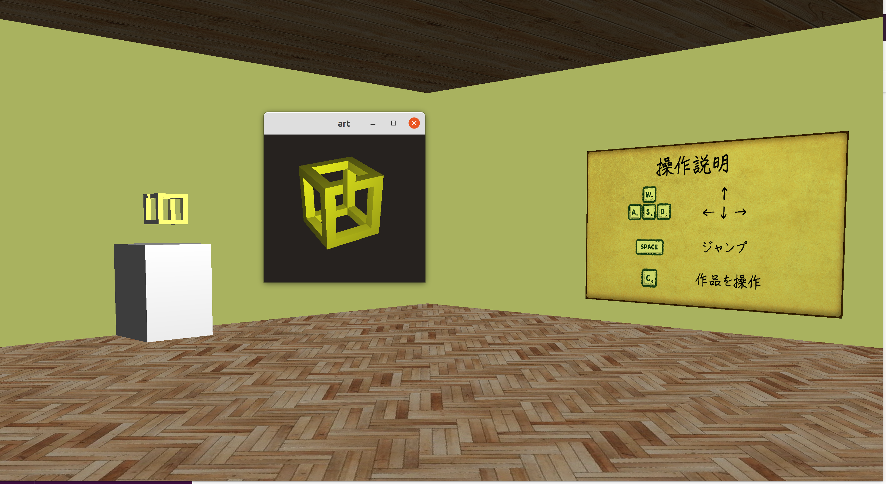

# 概要
トリックアートの中でもopenglの強みを活かした3次元の不可能立体を3つ制作しました。また、それらを収納し、見たいときに呼び出せる美術館も用意しています。美術館では数種類のコマンドを設定し、一人称視点で様々な動作を行うことができます。

<div style="text-align: center;">

</div>


# コンパイルと実行

```
// コンパイル(home.cppのコンパイルは最後)
$ make art1
$ make art2
$ make art3

$ make home

// 実行
$ ./home
```

# 操作説明

| キー入力              | 動作                       | 
| --------------------- | -------------------------- | 
| w                     | 前へ進む                   | 
| a                     | 左へ進む                   | 
| s                     | 後ろへ進む                 | 
| d                     | 右へ進む                   | 
| space                 | ジャンプ                   | 
| c                     | 作品を新ウィンドウで展開   | 
| p(新ウィンドウ展開後) | 錯視できる位置にカメラ移動 | 

